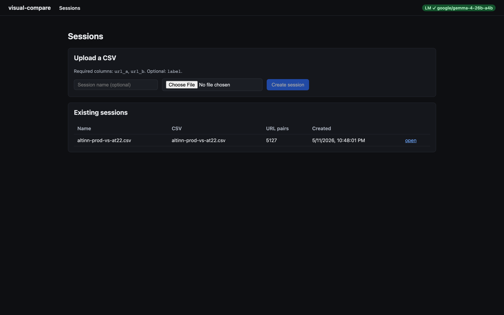
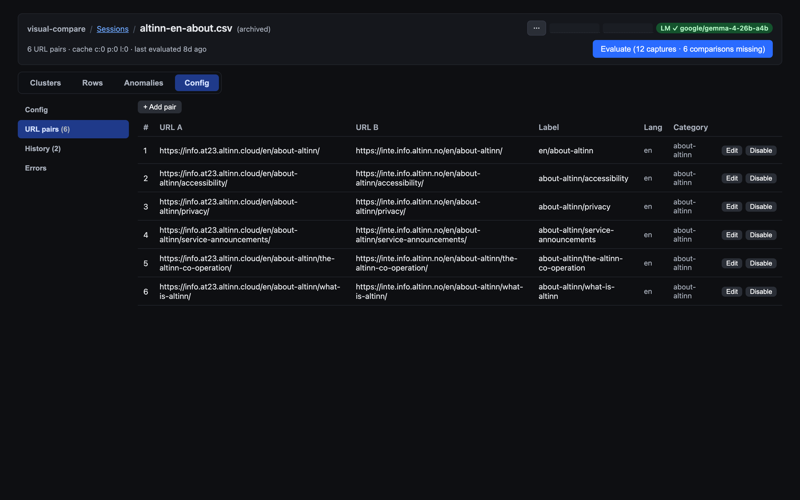
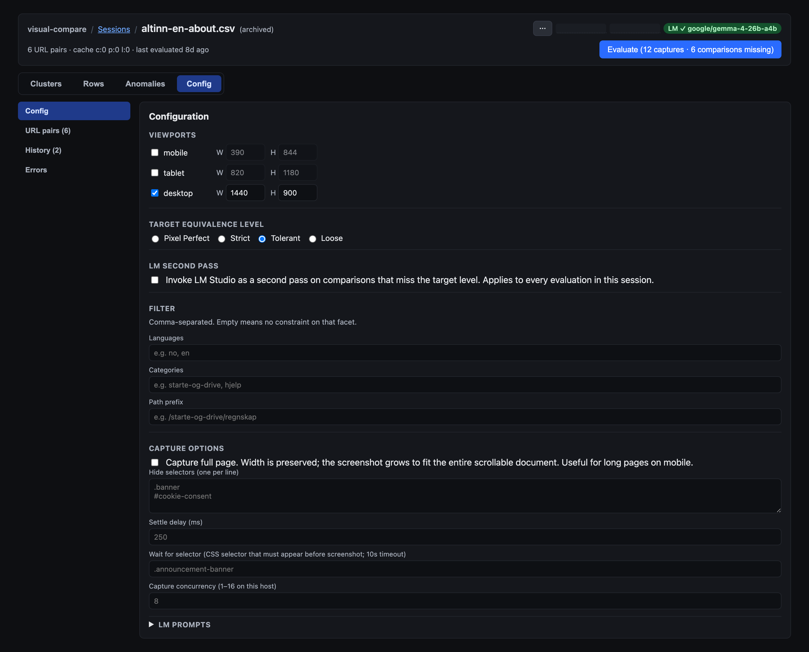
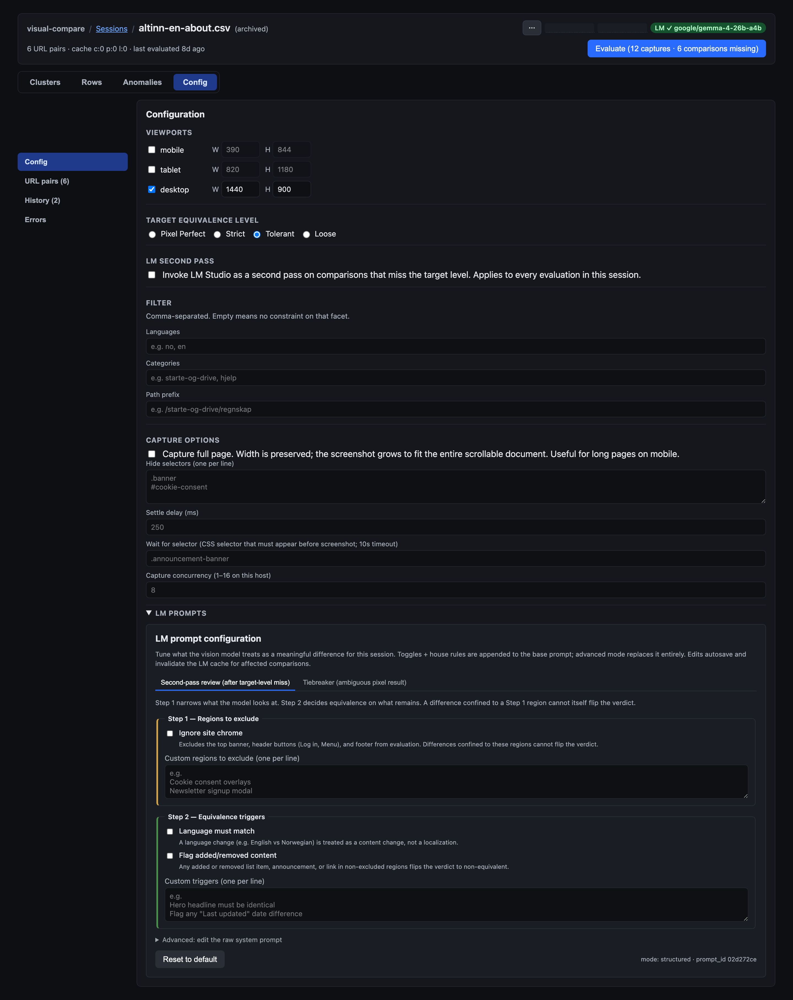
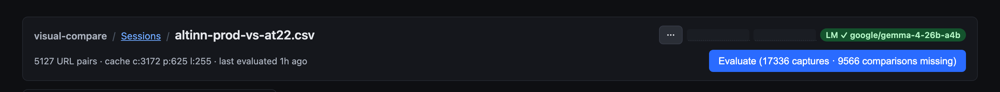
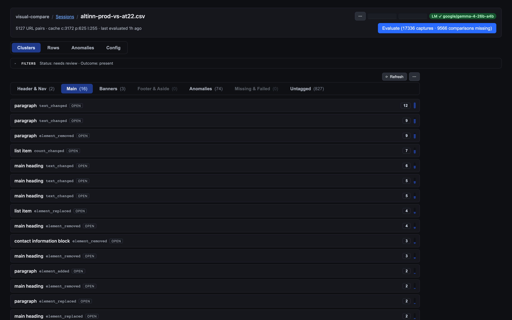
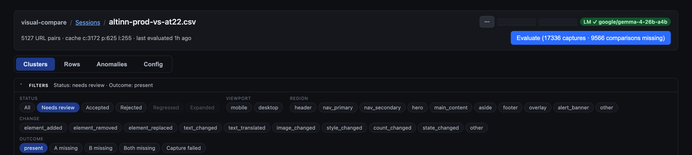
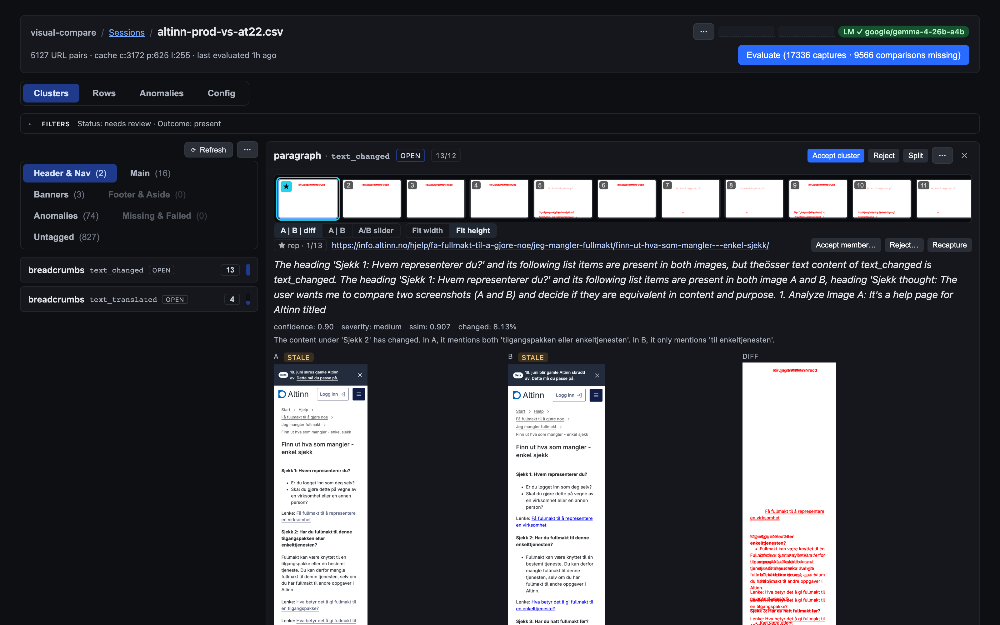
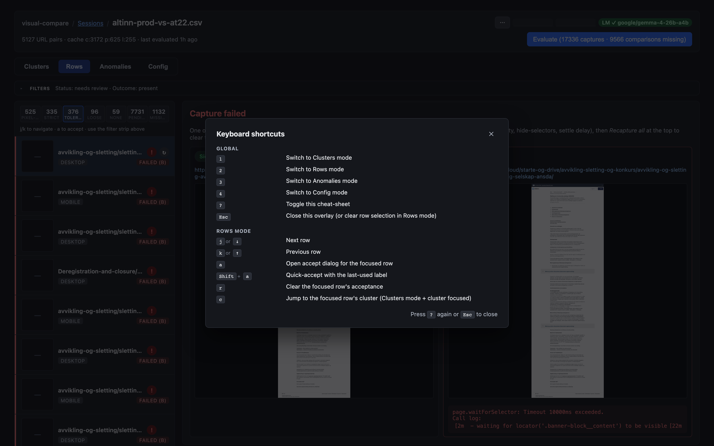
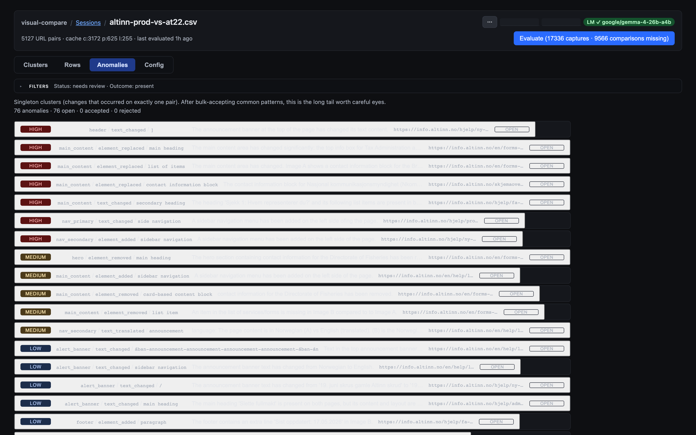

# Getting started

This walkthrough takes you from an empty install to a reviewed change-set.
Screenshots were captured against the dev build on `main`; if the UI has
moved on, the labels in the doc still match what the code renders.

For repo layout, requirements and dev-server commands, see the
[top-level README](../README.md). The rest of this guide assumes the API
is running on `:3011` and the web app on `:5173`.

## 1. Create a new session

A **session** is the unit of work: one CSV's worth of URL pairs, one set
of evaluation settings, and all the captures, comparisons, clusters and
acceptance rules that come out of them.

Open <http://localhost:5173/>. The landing page is split into an upload
form on top and the list of existing sessions below.

To create a session:

1. (Optional) type a name into **Session name (optional)**. If you leave
   it blank, the session takes the CSV's filename.
2. Pick a `.csv` file with the columns `url_a`, `url_b` (required) and
   optionally `label`. A few examples live under `samples/` in the repo.
3. Click **Create session**. The button shows **Uploading…** while the
   server parses the CSV and inserts the URL-pair rows, then drops you
   on the session detail page.

## 2. Verify the URL pairs

The session detail page has four review modes along the top —
**Clusters**, **Rows**, **Anomalies**, **Config** — and Config has four
sub-tabs: **Config**, **URL pairs**, **History**, **Errors**.

Click **Config → URL pairs** to confirm the import landed correctly:

Each row carries the parsed `url_a`, `url_b`, `label`, `lang`,
`category`, `subcategory` and `path` columns. **+ Add pair** inserts a
new row inline; **Edit** opens the row for editing; **Disable** excludes
the pair from future evaluations without deleting it. Everything
autosaves — there is no separate "save" step.

## 3. Configure the evaluation

Switch to the **Config** sub-tab. Every section autosaves; the status
chip in the chrome reads **Saving…**, **Saved**, or **Save failed**.

The sections, top to bottom:

- **Viewports** — tick each viewport you want captured. The size inputs
  (`W` / `H`) are editable; viewport widths feed Playwright's
  `setViewportSize` and the screenshot grows downward to whatever the
  page renders.
- **Target equivalence level** — the bar for "this pair passes":
  - **Pixel Perfect** — every pixel matches.
  - **Strict** — sub-pixel rendering differences are tolerated.
  - **Tolerant** — small anti-alias / antialias jitter is tolerated.
  - **Loose** — only large content changes are flagged.
  - Anything below the chosen level becomes a "miss" and shows up in
    Clusters / Rows / Anomalies for review.
- **LM second pass** — tick **Invoke LM Studio as a second pass on
  comparisons that miss the target level** to send each miss to a local
  LM for adjudication. Requires LM Studio running on `:1234`; the LM
  pill in the chrome shows the active model.
- **Filter** — restrict the evaluation to subsets of the CSV:
  - **Languages** (e.g. `no, en`), **Categories**, **Path prefix**. All
    are comma-separated; empty means no constraint.
- **Capture options** — Playwright settings:
  - **Capture full page** — scrolls the page to capture the full
    document instead of just the viewport.
  - **Hide selectors (one per line)** — CSS selectors hidden before the
    screenshot (cookie banners, chat widgets, etc.).
  - **Settle delay (ms)** — extra wait after navigation, before the
    screenshot. Useful for animations that don't await reliably.
  - **Wait for selector** — block the capture until a specific CSS
    selector appears (10s timeout).
  - **Capture concurrency** — parallel Playwright workers on this host;
    bound by CPU. Default is fine for most cases.

### LM prompts (collapsed by default)

Expand the **LM prompts** section at the bottom to inspect or edit the
prompts driving the LM second pass:

Two reasons share the same prompt vocabulary:

- **Second-pass review (after target-level miss)** — fires after pixel
  comparison misses the target level.
- **Tiebreaker (ambiguous pixel result)** — fires when the pixel
  comparison itself is ambiguous.

Each reason exposes the same toggles (**Ignore site chrome**,
**Language must match**, **Flag added/removed content**) plus
free-form **Custom triggers** boxes. **Reset to default** drops back to
the default v3 prompt. The serialized prompt is what the LM receives.

## 4. Start and stop the evaluation

The **Evaluate** button lives in the chrome at the top-right. Its label
is a live plan summary:

States the button cycles through:

- **`Evaluate (N captures · M comparisons missing)`** — work pending;
  press to start. The label updates as you tune Config; cache hits
  shrink the plan in real time.
- **`All cached`** — every pair already has a captured screenshot and a
  comparison at the current settings; nothing to do.
- **`Stop`** (secondary style, while running) — interrupts the
  evaluation. In-flight captures finish, the queue drains, the button
  switches to **`Stopping… X/Y`** until the worker pool quiesces.
- **`Evaluation complete`** / **`Error: <message>`** — terminal status
  lines under the bar.

While the evaluation runs, a progress strip under the chrome shows the
current phase (`capture` or `comparison`), total / remaining counts,
items-per-second once two samples are in, and an ETA. Polling pauses
when the tab is in the background — switch back to the tab to resume.

If you have to stop a long evaluation, the **resume on restart**
behavior kicks in: the next time the API starts it picks the queue
back up automatically.

## 5. Review the clusters

When the evaluation finishes, switch to **Clusters** mode. The
clustering pass groups every miss by a (`region_role`, `change_type`,
`element_label`) signature so you accept or reject a whole family at
once instead of clicking through pair-by-pair.

The top of the list is a row of **category tabs** — **Header & Nav**,
**Main**, **Banners**, **Footer & Aside**, **Anomalies**, **Missing &
Failed**, **Untagged**. The count in parentheses is the number of
clusters in that category for the current filter. Each row shows the
**element label**, the **change type code** (`text_changed`,
`element_removed`, `count_changed`, etc.), a **state pill**
(`OPEN`, `ACCEPTED`, `REJECTED`, `SPLIT`), and the **pair count**.

### Filters

Click **FILTERS** to expand the filter strip. It collapses to a
summary line showing the active selection:

The strip is grouped by zone:

- **Status** — single-select: `All`, `Needs review`, `Accepted`,
  `Rejected`, `Regressed`, `Expanded`.
- **Viewport** — multi-select chips, only shown when more than one
  viewport is in the data.
- **Region** — multi-select: `header`, `nav_primary`, `nav_secondary`,
  `hero`, `main_content`, `alert_banner`, `overlay`, `footer`, `aside`,
  `other`.
- **Change** — multi-select over change-type codes
  (`element_added`, `element_removed`, `element_replaced`,
  `text_changed`, `text_translated`, `image_changed`, `style_changed`,
  `count_changed`, `state_changed`, `other`).
- **Outcome** — single-select: `present`, `A missing`, `B missing`,
  `Both missing`, `Capture failed`.

All filters apply to the cluster list, the rows list and the anomalies
list — switching modes preserves what you have selected.

### Diff modes and accept/reject

Click a cluster row to open the **detail pane** on the right:

At the top of the pane:

- The **chrome title** carries the cluster label, the change-type code,
  a state pill, and a counts badge (`X/Y` members, `X/Y accepted` when
  partial).
- Three action buttons:
  - **Accept cluster** — opens a confirm dialog and snapshots every
    member pair as accepted under a rule scoped to this cluster
    signature. Future evaluations that re-derive the same signature
    inherit the acceptance.
  - **Reject** — flips the cluster to `rejected`, removes any
    rule-owned acceptances on its members. Use this when the diff is a
    real regression.
  - **Split** — extract a subset of members into a new sibling cluster.
    Useful when the clustering pass over-grouped genuinely different
    changes.
  - **⋯** overflow — **Recapture cluster pairs** (invalidates the
    cache for these pairs and re-evaluates them) and **Open in new
    tab** (focus this cluster in a fresh window for side-by-side
    review with another cluster).

Below the buttons:

- A **filmstrip** of every member in the cluster — click a thumbnail
  to jump to that pair. Accepted members carry a ✓; rejected members
  carry a ✗; the cluster's **representative** member is starred (★).
- The **view-mode toggle** chooses how the focused pair is rendered:
  - **A | B | diff** — three columns side-by-side, with the diff
    overlay third.
  - **A | B** — two columns, no diff overlay.
  - **A/B slider** — drag the handle to wipe between A and B.
- The **fit-mode toggle** chooses between **Fit width** and **Fit
  height** for the image area.
- Below the toolbar: the LM verdict summary (when LM second pass is
  on), the pixel metrics row, and the per-member action row (`Accept
  member`, `Reject…`, `Recapture`).

### Keyboard shortcuts

Press **?** anywhere on the session page to bring up the cheat sheet:

Highlights:

- **1 / 2 / 3 / 4** — switch to Clusters / Rows / Anomalies / Config.
- **?** — toggle the cheat-sheet.
- **Esc** — close the overlay (or clear row selection in Rows mode).

Rows mode adds **j / k** (or **↓ / ↑**) to step rows, **a** to open
the accept dialog, **Shift+a** to quick-accept with the last-used
label, **r** to clear acceptance, and **c** to jump from a row to its
parent cluster in Clusters mode.

### Suggested workflow

A fast triage loop:

1. Filter **Status: Needs review · Outcome: present**.
2. Walk the **Header & Nav** and **Footer & Aside** categories first
   — these are usually noise (cookie banners, chat widgets, build
   stamps). **Accept cluster** the ones you can rule out wholesale.
3. Move to **Main**, **Banners** and any other content-bearing
   categories. Use the filmstrip + diff modes to spot-check the
   representative and a few outliers. **Reject** real regressions;
   **Accept cluster** intentional content changes.
4. Re-filter to **Status: Accepted** for a final sanity pass before
   handing the session off.

## 6. Review anomalies

Anything that didn't fit into a multi-pair cluster lands in
**Anomalies** mode: singleton clusters that didn't recur anywhere
else in the session.

The list is flat (no category tabs) and sorted by severity —
**HIGH** at the top, then **MEDIUM**, **LOW**, **none**. The filter
strip applies the same way as in Clusters mode (Status + Outcome
chips are the usable ones here).

Clicking an anomaly opens the same detail pane as a cluster, with the
same accept / reject buttons; an "accept" on an anomaly is just an
accepted acceptance rule with a single pair.

Anomalies are where post-bulk-acceptance signal lives. Once you've
swept the common patterns from Clusters mode, anomalies are the long
tail worth careful eyes — a unique missing element on one page is
exactly the kind of regression that wouldn't have grouped with
anything.

## Where to go next

- **History** sub-tab (under Config) — every past evaluation, with
  capture-run and comparison-run IDs and the config snapshot they ran
  with.
- **Errors** sub-tab — capture failures (DNS, timeout, missing
  selector) and per-pair recapture buttons.
- **Recapture** flows for individual pairs, clusters or the whole
  session — invalidate the cache and re-run captures when upstream
  fixes land.
- **Worktrees + shared image store** — for parallel feature work on
  several branches without duplicating screenshots. See the
  [README's worktree section](../README.md#sharing-the-image-store-across-worktrees).
